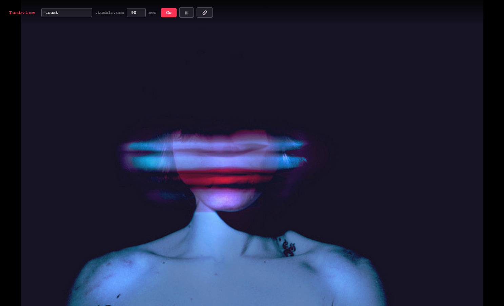
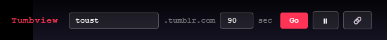
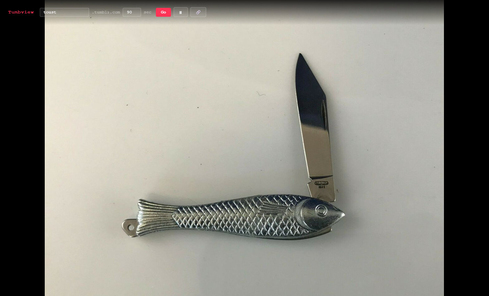
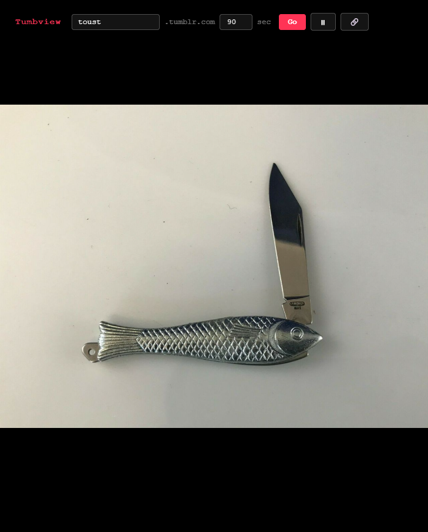

# Tumbview

A fullscreen slideshow viewer for any public Tumblr blog. Point it at a blog name and it plays a random, non-repeating sequence of that blog's photos.

**Try it live:** [latostadorano.github.io/tumbview_ovvo](https://latostadorano.github.io/tumbview_ovvo/)

## What it does

Tumbview fetches photo posts from a Tumblr blog through the Tumblr API and displays them one at a time, fullscreen, on a black background. Photos play in random order without repeats; once every photo on the current page has been shown, it automatically fetches the next page and keeps going. No build step, no dependencies — just static HTML/CSS/JS.

## Use cases

- **Party / event visuals.** Drop in a blog and let it run on a screen or projector as simple, hands-off ambient visuals — no VJ software required.
- **Finding content to repost.** Tumblr users can flip through a blog's photo posts fullscreen, distraction-free, to quickly spot images worth reblogging to their own Tumblr.

## Features

- Load any public Tumblr blog by name
- Adjustable slide interval (1–120 seconds)
- Random, non-repeating photo order with automatic pagination
- Play / pause
- Next / previous navigation (previous steps back through playback history)
- Open the current photo's original Tumblr post in a new tab
- Minimal UI that auto-hides during playback and reappears on mouse move or key press

## Controls

| Input | Action |
|---|---|
| `Enter` | Load the blog and start |
| `Space` / `→` | Next photo |
| `←` | Previous photo |
| Click on photo | Next photo |
| ▶ / ⏸ button | Play / pause |
| 🔗 button | Open current photo's post on Tumblr |

## Setup

Tumbview needs a Tumblr API key to fetch posts. The repo ships with `config.js` containing a public, read-only demo key, so it works out of the box — no setup needed to just try it.

To use your own key instead:

1. Get a free key at [tumblr.com/oauth/apps](https://www.tumblr.com/oauth/apps).
2. Replace the value in `config.js` (or copy `config.example.js` over it):
   ```js
   window.TUMBVIEW_CONFIG = {
     apiKey: 'YOUR_TUMBLR_API_KEY'
   };
   ```

## Usage

No install or build required. Either:

- Open `index.html` directly in a browser, or
- Serve the folder with any static file server (e.g. `npx serve .`)

Then type a blog name (without `.tumblr.com`), set the interval in seconds, and click **Go**.

## Screenshots



<p>
  
</p>
<p>
  
  
</p>

---

**Live demo:** [latostadorano.github.io/tumbview_ovvo](https://latostadorano.github.io/tumbview_ovvo/)

